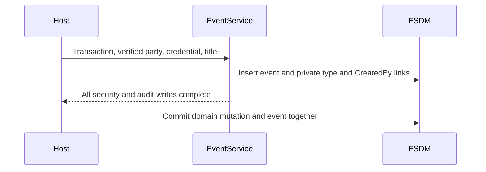

# Private actor events

Authenticated hosts append an actor-attributed event in their existing stateless
transaction with `IEventService.createActorEvent`. The host resolves the actor
and credential server-side. The event, type link and CreatedBy link use restricted
security and the actor's read scope. Security failures abort the transaction.
Titles describe actions and must not contain private field values.

