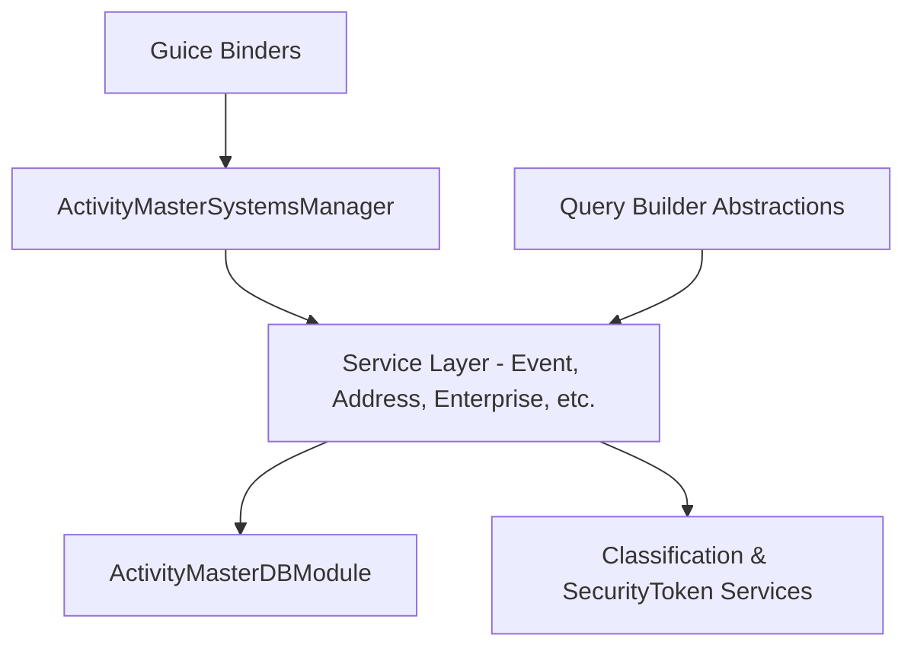

# C4 Level 3 — FSDM Components

Within the FSDM bounded context, the major components are:

| Component | Responsibility |
| --- | --- |
| `Event`, `Arrangements`, `Address`, `Enterprise`, `Product`, `Rules`, `SecurityToken` services | Provide reactive CRUD/lookup endpoints for each domain slice while honoring classification/security tokens. |
| `Classification`, `ClassificationDataConcept`, `Geography`, `InvolvedParty`, `ResourceItem`, `ActiveFlag` services | Surface specialized domain slices (classification concepts, geographies, actors, record status) that feed the top-level enterprise view and control operational state. |
| `Enterprise` + `Systems` components | An Enterprise defines the top-level organization and the Systems it enables; functionality is gated per system, and each action respects ActiveFlag status and per-row security tokens. |
| `ISystemUpdate` / `@SortedUpdate` pipelines | Each system’s bootstrap update pipeline is responsible for loading classifications/types. Only `ProductType` and `EventType` may be created outside these updates; all other classification/type rows must originate from the ordered update steps (see `EventsBaseSetup`, `AddressBaseSetup`, etc.). |
| `ActivityMasterDBModule` / `ActivityMasterDestinationDBModule` | Wire Hibernate Reactive 7 connectors, naming strategies, and DAO helpers for PostgreSQL. |
| `ActivityMasterSystemsManager` | Bootstraps the GuicedEE runtime, assembles binders, and exposes `IActivityMasterSystem` for other modules. |
| Binder classes (e.g., `EventsBinder`, `PasswordsServiceBinder`) | Register individual services with Guice/GuicedEE so clients can inject them by interface. |
| Query builders (e.g., `ArrangementQueryBuilder`, `AddressXClassificationQueryBuilder`) | Offer fluent builders for the datastore; align with the selected CRTP fluent API strategy. |

Component naming follows the host repository package layout (see `src/main/java/com/guicedee/activitymaster/fsdm`). The CRTP fluent API strategy, enforced by the Rules Repository adoption, constrains the builders to return `(J)this` with `@SuppressWarnings("unchecked")` where needed.
Every service also passes `SecurityToken` metadata, ensuring value-level access control on each row and aligning with the ActiveFlag status that marks record state.
