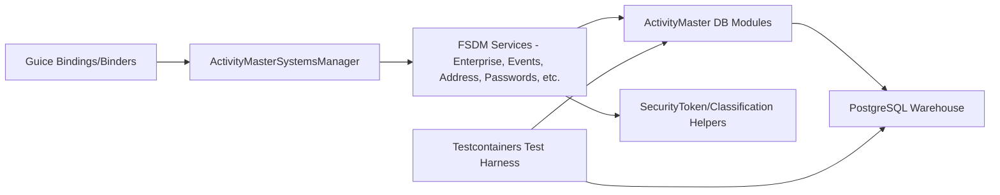

# C4 Level 2 — Container Diagram

The key containers inside ActivityMaster Core are structured around the `com.guicedee.activitymaster.fsdm` package:

- **ActivityMasterSystemsManager** and binders orchestrate bootstrapping the domain services via Guice.
- **FSDM Services** (e.g., `EventsService`, `EnterpriseService`, `PasswordsService`) provide Vert.x-friendly APIs tied to `Hibernate Reactive 7` entities.
- **ActivityMaster DB Modules** configure `PostgreSQL` connectivity, including `ActivityMasterDBModule` and `ActivityMasterDestinationDBModule` that supply reactive connectors and transaction abstractions.
- **Security & Classification Helpers** rely on `SecurityTokenService`, `ClassificationService`, and the various `X` join builders.
- **Test Harness** uses `Testcontainers` (via `TestActivityMaster` tests) plus `PostgreSQLTestDBModule` to provision isolated Postgres instances.

Each container is backed by Maven modules, Lombok annotations (e.g., `@Log4j2` policy), and the `btm-config.properties` configuration file for data sources.
