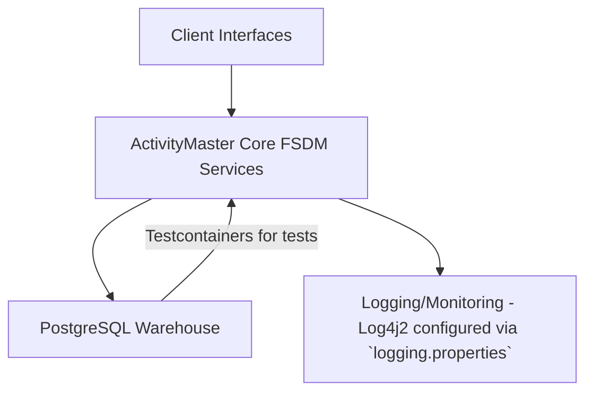

# C4 Level 1 — System Context

| System | Role |
| --- | --- |
| ActivityMaster Core | The Java 25 Maven service library (GuicedEE + Vert.x 5 + Hibernate Reactive 7) that exposes the FSDM domain services and binds them into desktop or integration clients through Guice injections. |
| Client interfaces | Applications call the Guiced modules directly through the provided client interfaces, so no separate desktop client exists. |
| PostgreSQL Warehouse | Canonical persistence store (Warhouse tables defined under `src/main/resources/META-INF`). |

ActivityMaster Core trusts the PostgreSQL warehouse schema (scripts under `src/main/resources/META-INF`) and trusting clients that supply entity tokens and security classifications through Guice-powered services.
