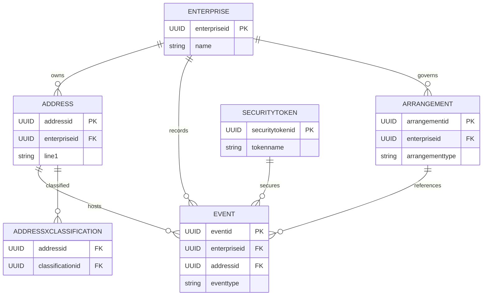

# ERD — Core FSDM Domain

The core relational domain reuses the following tables, reflecting the entities under `src/main/java/com/guicedee/activitymaster/fsdm/db/entities`:

The ERD intentionally keeps the join tables (e.g., `AddressXClassification`, `ArrangementXRules`) abstracted as classification relationships managed via the `ClassificationService` and `QueryBuilder` helpers. PostgreSQL schema scripts under `src/main/resources/META-INF` enforce these foreign keys and indexes.
