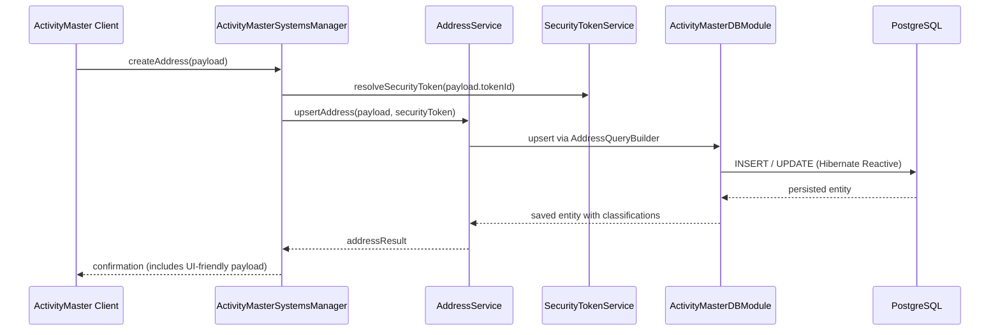

# Sequence — Address Creation Flow

Captures the steps when a new address is provisioned through the service layer.

The upstream UI uses predictable payload naming per the host domain model and expects Log4j2 instrumentation for observability. All insert/update steps are sequential on the Mutiny `Session` because Hibernate Reactive 7 requires each database mutation to complete before the next begins; the service layer enforces that by emitting the next reactive stage only after the previous one completes, preserving the session’s sequential pipeline.
