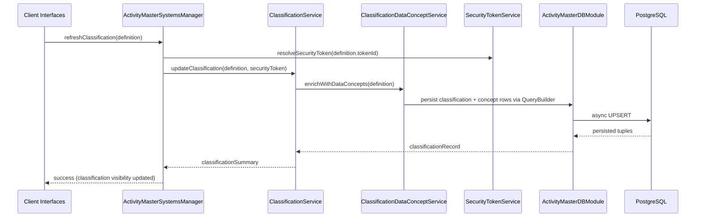

# Sequence — Classification Update Flow

Shows how classification concepts are refreshed within the domain.

The flow ensures classification data concepts and related `X` join tables are updated atomically and that clients receive the adjusted security/access state via the ActiveFlag status. Classification and type records (including `Classification`, `ClassificationDataConcept`, `RulesType`, `ResourceItemType`, etc.) are only ever created through the `ISystemUpdate`/`@SortedUpdate` mechanism driven by each system’s update pipeline; free-form creation in client code or external services is forbidden except for `ProductType` and `EventType`, which remain safe to upsert at runtime when business logic requires new options.
