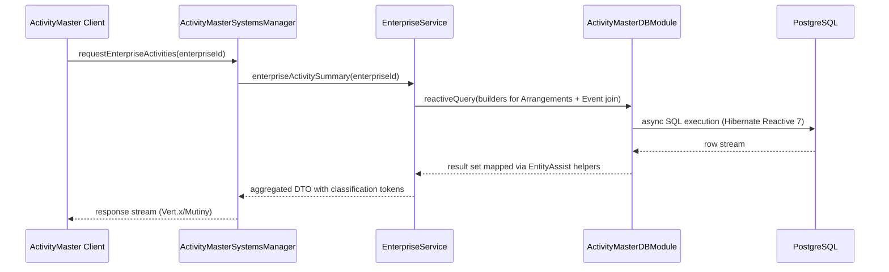

# Sequence — Enterprise Activity Retrieval

This sequence covers a typical query issued by a Guice-integrated client (e.g., ActivityMaster Desktop) to list enterprise-related arrangements and their events.

The flow relies on `EntityAssist` utilities (see `rules/generative/data/entityassist/README.md`) to hydrate DTOs and ensures classification/security tokens travel alongside each row.
