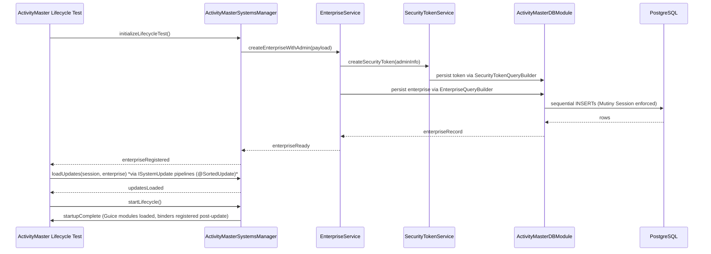

# Sequence — Enterprise Lifecycle via Test Harness

This sequence captures how the existing test suite (`src/test/java/com/guicedee/activitymaster/tests/TestActivityMasterLifecycle.java` and supporting helpers) creates an enterprise, registers an admin user, runs the update loaders, and starts the ActivityMaster stack in the test harness.

The test suite orchestrates `ActivityMasterSystemsManager` and `ActivityMasterPostStartup` with `ISystemUpdate`/`@SortedUpdate` pipelines (e.g., `ProductsBaseSetup`, `EventsBaseSetup`, `ResourceItemsBaseSetup`), which bootstrap classification/type data before the enterprise runs. `TestActivityMasterLifecycle` demonstrates that after `createNewEnterprise` sets up the base systems, the harness calls `loadUpdates(session, enterprise)` before invoking `startNewEnterprise(session, name, admin, password)`, so updates complete prior to the admin registration and post-startup service wiring. The startup sequence itself installs systems, creates the enterprise, runs the obligatory updates, registers the admin user via `IPasswordsService`, and performs post-startup hooks—all while keeping Mutiny `Session` calls sequential and respecting ActiveFlag/security tokens.
