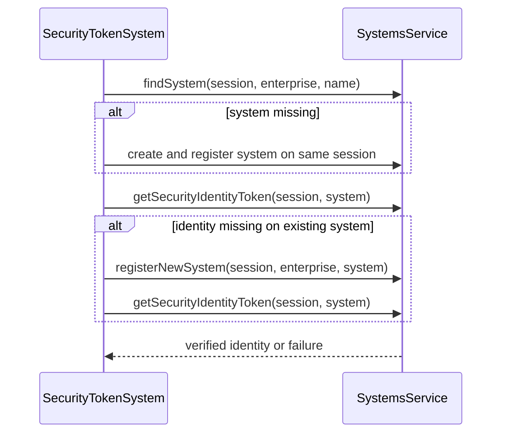
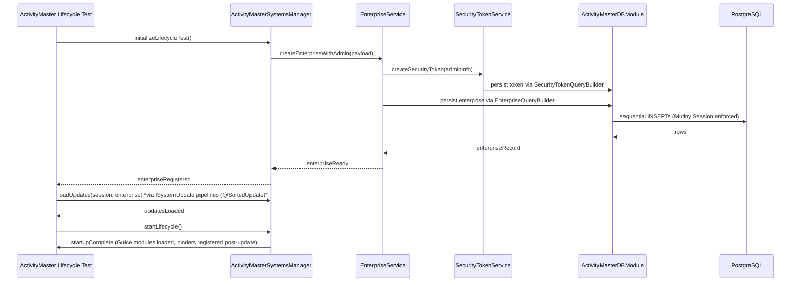

# Sequence — Enterprise Lifecycle via Test Harness

## Stateless update transaction failures

`EnterpriseService.loadUpdates` uses the caller's stateless transaction for the
entire sequential sweep. False/null update results, update exceptions and start/end
callback exceptions must propagate, stop the sweep and prevent the last-update
stamp. The transaction owner rolls back data and completion receipts together.
Failure callbacks are notified once for the failing update; their own exceptions
must not replace the primary failure or prevent other failure notifications.
Retry requires a fresh transaction and normal discovery of unapplied updates.
Completion callbacks indicate execution within the transaction, not committed data.
This does not provide atomicity for external side effects or concurrent sweeps.
Every update must use the supplied session. In particular, geography taxonomy and
grant creation must not commit an inner transaction independently of its update receipt.
Geography finders must not retain classification IDs read from an uncommitted
transaction in a process-wide map. A rolled-back type is recreated with a new ID
on retry; planet/continent lookup must resolve it through the caller's session.

## Security system startup recovery

`SecurityTokenSystem.postStartup` verifies the system registration and its identity on the caller's
stateless session. A missing system row or identity (`NoResultException`, including an empty result)
triggers one registration repair, followed by a fresh identity lookup before startup can continue.
An existing system is repaired through `SystemsService.registerNewSystem`, which reuses its token
and links. Healthy startup performs no registration writes. Recovery does not rerun enterprise-wide
security defaults or disable access checks. Other failures, failed registration, and a still-missing
identity propagate to the startup caller.

Registration resolves `SystemIdentity` by enterprise and data concept. This stateless classification
lookup projects scalar columns and attaches the already-resolved concept and enterprise, matching
the other stateless finders. Hydrating the classification's eager association graph on this path can
fail in Hibernate Reactive's load-context cleanup before the missing identity link is inserted.

```mermaid
sequenceDiagram
  participant Startup as SecurityTokenSystem
  participant Systems as SystemsService
  Startup->>Systems: findSystem(session, enterprise, name)
  alt system missing
    Startup->>Systems: create and register system on same session
  end
  Startup->>Systems: getSecurityIdentityToken(session, system)
  alt identity missing on existing system
    Startup->>Systems: registerNewSystem(session, enterprise, system)
    Startup->>Systems: getSecurityIdentityToken(session, system)
  end
  Systems-->>Startup: verified identity or failure
```

This sequence captures how the existing test suite (`src/test/java/com/guicedee/activitymaster/tests/TestActivityMasterLifecycle.java` and supporting helpers) creates an enterprise, registers an admin user, runs the update loaders, and starts the ActivityMaster stack in the test harness.

```mermaid
sequenceDiagram
  participant Test as ActivityMaster Lifecycle Test
  participant Systems as ActivityMasterSystemsManager
  participant EnterpriseSvc as EnterpriseService
  participant Security as SecurityTokenService
  participant DB as ActivityMasterDBModule
  participant Postgres as PostgreSQL

  Test->>Systems: initializeLifecycleTest()
  Systems->>EnterpriseSvc: createEnterpriseWithAdmin(payload)
  EnterpriseSvc->>Security: createSecurityToken(adminInfo)
  Security->>DB: persist token via SecurityTokenQueryBuilder
  EnterpriseSvc->>DB: persist enterprise via EnterpriseQueryBuilder
  DB->>Postgres: sequential INSERTs (Mutiny Session enforced)
  Postgres-->>DB: rows
  DB-->>EnterpriseSvc: enterpriseRecord
  EnterpriseSvc-->>Systems: enterpriseReady
  Systems-->>Test: enterpriseRegistered
  Test->>Systems: loadUpdates(session, enterprise) *via ISystemUpdate pipelines (@SortedUpdate)*
  Systems-->>Test: updatesLoaded

  Test->>Systems: startLifecycle()
  Systems->>Test: startupComplete (Guice modules loaded, binders registered post-update)
```

The test suite orchestrates `ActivityMasterSystemsManager` and `ActivityMasterPostStartup` with `ISystemUpdate`/`@SortedUpdate` pipelines (e.g., `ProductsBaseSetup`, `EventsBaseSetup`, `ResourceItemsBaseSetup`), which bootstrap classification/type data before the enterprise runs. `TestActivityMasterLifecycle` demonstrates that after `createNewEnterprise` sets up the base systems, the harness calls `loadUpdates(session, enterprise)` before invoking `startNewEnterprise(session, name, admin, password)`, so updates complete prior to the admin registration and post-startup service wiring. The startup sequence itself installs systems, creates the enterprise, runs the obligatory updates, registers the admin user via `IPasswordsService`, and performs post-startup hooks—all while keeping Mutiny `Session` calls sequential and respecting ActiveFlag/security tokens.
