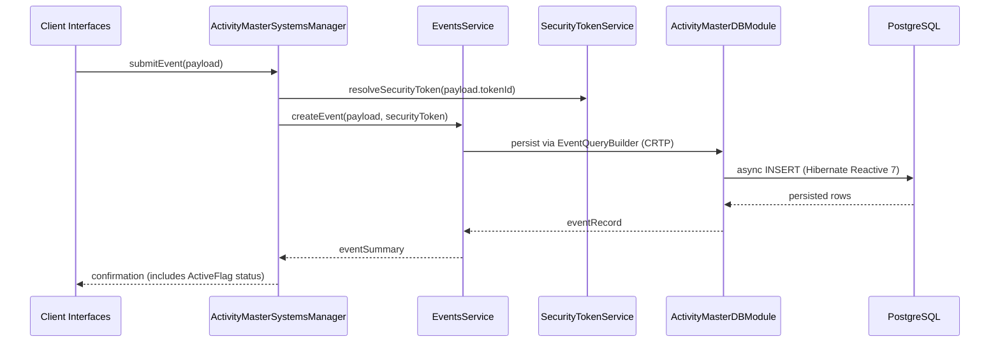

# Sequence — Event Creation Flow

Captures how an event payload is persisted through the FSDM stack.

Security tokens and ActiveFlag metadata are threaded through the call to enforce value-level access control while classification tables (e.g., `EventXClassification`) are resolved within the `EventService` before persistence. Each interaction executes sequentially on the Mutiny `Session`; because Hibernate Reactive 7 forbids parallel inserts/updates/deletes on the same session, the service stages emit the next DB mutation only from the reactive continuation after the prior stage completes rather than invoking `.await()` or sharing a session across parallel calls.
