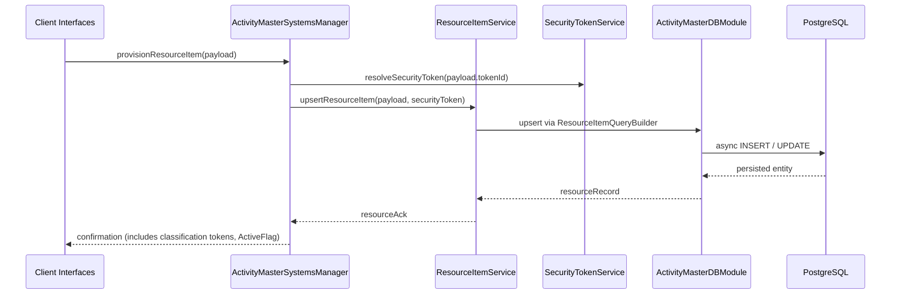

# Sequence — ResourceItem Provisioning Flow

Documents how resource items (e.g., personnel or equipment) are created or updated.

Every ResourceItem change respects value-level security tokens, and the ActiveFlag metadata tracks whether the row is active, archived, or otherwise filtered during downstream queries.
