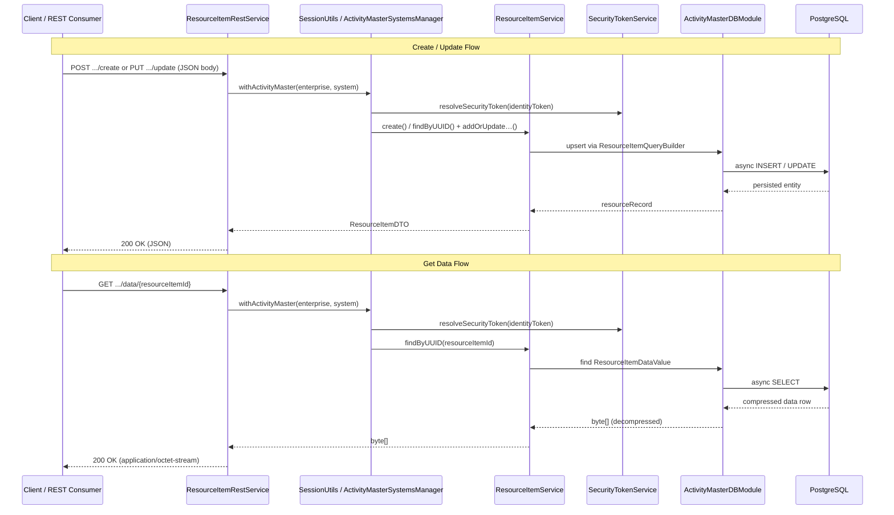

# Sequence — ResourceItem Provisioning Flow

Documents how resource items (e.g., personnel or equipment) are created, updated, or retrieved via the REST API.

Every ResourceItem change respects value-level security tokens, and the ActiveFlag metadata tracks whether the row is active, archived, or otherwise filtered during downstream queries.

See `RESOURCE_ITEM_REST_API.md` in `src/main/java/com/guicedee/activitymaster/fsdm/rest/resourceitem/` for the full endpoint reference.

