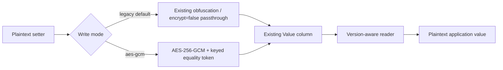

# Opt-in column encryption

This protects `Address.Value` and `InvolvedPartyXInvolvedPartyIdentificationType.Value`,
replacing their existing reversible ASCII-offset obfuscation. It is not whole-table/database
encryption. Password hashing, party names, other columns and authorization are unchanged.

**Recommended for multi-enterprise deployments:** [enterprise envelope encryption with
Azure Key Vault](enterprise-encryption.md). That mode generates an independent DEK per
enterprise and persists only wrapped keys. This page describes the compatible deployment-key
`aes-gcm` (version 1) mode; its setup and key-rotation instructions do not apply to v2.

## Configuration

Non-secret settings use GuicedEE `Environment` (system properties/environment/.env):

| Property | Environment variable | Default |
|---|---|---|
| `activitymaster.encryption.mode` | `ACTIVITYMASTER_ENCRYPTION_MODE` | `legacy` |
| `activitymaster.encryption.key-id` | `ACTIVITYMASTER_ENCRYPTION_KEY_ID` | `primary` |
| `activitymaster.encryption.read-key-ids` | `ACTIVITYMASTER_ENCRYPTION_READ_KEY_IDS` | empty |
| `activitymaster.encryption.enterprise-reads` | `ACTIVITYMASTER_ENCRYPTION_ENTERPRISE_READS` | `false` |

Set mode to `aes-gcm` explicitly. Provision a cryptographically random 32-byte master key,
standard Base64 encoded, as `ACTIVITYMASTER_ENCRYPTION_KEY_PRIMARY` (or the uppercase
key ID). IDs must be lowercase ASCII letters/digits, 1–32 characters.
For tests, the equivalent system property is `activitymaster.encryption.key.primary`.
**Secrets deliberately bypass Environment's .env/debug logging**: only system properties
and environment variables are accepted for key material. Inject secrets from your secret
manager; never commit them, log them or put them in command-line arguments.

AES mode overrides the historical `encrypt=false` write escape hatch. Without opting in,
the existing `encrypt` and `ascii.offset` settings and legacy write format are unchanged.
Strong envelopes are always decrypted, including in legacy mode or with `encrypt=false`.
An invalid mode/key, unknown envelope version, missing read key or authentication failure
throws: it must never downgrade a configured strong write or return damaged ciphertext.

## Version-1 format and search

`amenc:1:<key-id>:<64 hex equality-token>:<Base64(nonce || ciphertext || tag)>`

Each write uses a new secure-random 96-bit nonce and a 128-bit GCM authentication tag.
HMAC-SHA256 domain separation derives independent encryption and lookup keys from the
master key. The column context and complete envelope header are authenticated as AAD.
The equality token also includes the column context; ciphertext cannot be moved between
the two column types. It is not bound to a row/tenant: same-column row substitution is
outside this format's guarantees.

The keyed lookup token intentionally reveals equality/frequency within a column/key,
but does not expose the old obfuscation or an unkeyed hash alongside new ciphertext.
`withValue(Equals/NotEquals, ...)` in strong/read-key mode combines legacy obfuscated,
legacy plaintext and all configured key-token matches in **one grouped SQL predicate**,
preserving existing security/tenant filters. GCM ciphertext itself is randomized.
Null predicates are supported. Pattern, range and list operands are rejected in this
mode; use exact equality, not wildcard searches. Direct SQL/`where(value, ...)` bypasses
this contract and must be updated by applications to use `withValue`.

## Rollout, capacity and rotation

1. Deploy the compatible readers to **all** application nodes before enabling strong
   writes. Old binaries cannot read the new format.
2. Back up the database and test a restore **with separately backed-up keys**. Losing a
   key means losing the corresponding data. Encryption does not replace TLS, database
   access controls, disk encryption or backup encryption.
3. Enable `aes-gcm` with the same key configuration on all nodes. No automatic bulk
   migration occurs: existing rows remain readable; values subsequently passed through
   their setters are written in the selected format. Migrate old values explicitly in
   authorized, batched transactions if required.
4. Existing columns are mapped as varchar(255). Strong writes reject envelopes longer
   than 255 characters *before* persistence, rather than truncate them. Envelope length
   is `74 + key-id.length + 4 * ceil((UTF-8 bytes + 28)/3)`; with ID `primary`, up to
   101 UTF-8 bytes fit. This is a byte limit, not a character limit. No schema change is
   imposed on existing customers. Larger encrypted payloads require a future explicit
   column-capacity migration and mapping change.
5. To rotate, deploy both old/new keys and put old IDs in comma-separated
   `read-key-ids`; switch `key-id` to the new ID. Exact searches cover both. Read keys
   are also selected from the envelope ID, so keep the secrets for every persisted ID.
   Re-save values to migrate, then verify completion before retiring old keys.
6. To return to legacy writes, set mode to `legacy` and retain all encrypted IDs in
   `read-key-ids` (including the former active ID) plus their secrets. Reads/searches
   still work. This is not permission to roll back to an old binary.

The mode setting remains deployment-wide. In `aes-gcm` mode the secret is shared across
enterprises; `enterprise` mode uses separate wrapped DEKs. Restart nodes after configuration
changes; do not mutate settings concurrently with requests. When rolling v2 data back to
legacy writes, set `enterprise-reads=true` and continue preparing enterprise keys so queries
remain v2-aware. Never remove keys merely because the write mode has changed.

