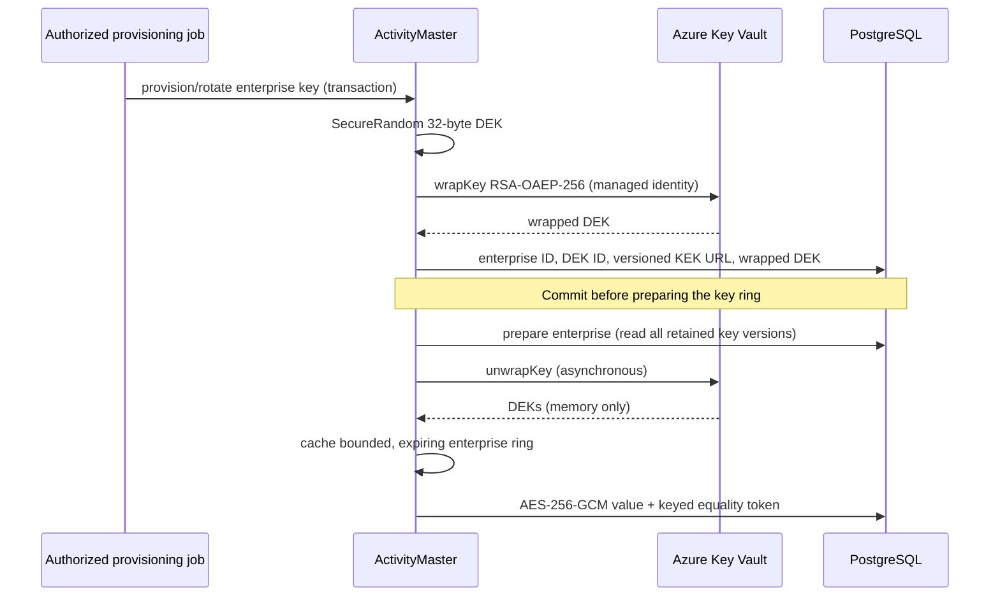

# Enterprise envelope encryption (Azure Key Vault)

## Architecture

Each enterprise owns its DEKs, not individual user parties. Authorization remains the
existing ActivityMaster security model. A shared application identity can unwrap keys
for the enterprises it serves; this is cryptographic separation, not protection against
a compromised application process. Dedicated identities/vaults are needed for that boundary.

`EnterpriseEncryptionService` is a trusted in-process administration/preparation API,
not an unauthenticated REST endpoint. The caller must authorize administration, supply
the correct enterprise UUID and use its existing reactive session/transaction.
`provision` creates the initial active DEK; `rotate` deactivates the previous write key
and retains it for reads. Neither publishes uncommitted keys to the runtime cache.
After commit, call `prepare` to load keys on each serving node. A failed transaction
must not change the published ring. No keys are generated just by reading data.

## Runtime integration

Set `activitymaster.encryption.mode=enterprise` only after provisioning and deploying
the compatible readers. Legacy mode remains the default; deployment-key `aes-gcm`
and version-1 rows remain supported. Keep old deployment secrets/read-key IDs while
migrating version-1 rows. No automatic data rewrite occurs.

At an authorized entry point, compose `service.ensurePrepared(session, enterpriseId)` **before**
the domain operation (for example inside `SessionUtils.withActivityMaster`, using its
session and resolved enterprise). `ensurePrepared` reuses an unexpired ring; `prepare`
always reloads and must be used for administrative refreshes. Preparation performs
database/Key Vault I/O reactively.
The service restores the subscription's Vert.x context after wrapper completions,
before touching the caller's Hibernate session or resuming downstream domain work.
Do not put it in getters, setters, or use `await` on the event loop. Direct callers and
stateless jobs must arrange equivalent preparation with a stateful preparation session
before starting their own work. Existing SessionUtils callbacks are not implicitly modified.

Getters/setters use the entity's own `enterpriseID` FK identifier, never a ThreadLocal or
untrusted envelope tenant ID. Assign enterprise **before** setting a protected value.
Builders require `withEnterprise(enterprise)` **before** `withValue` in enterprise mode.
Absent/expired key rings fail closed with a preparation error; they never write weak data.
Prepare also when reading version-2 rows after switching back to legacy write mode.
Set `activitymaster.encryption.enterprise-reads=true` for that rollback so value queries
continue to derive v2 tokens and fail closed if their ring is unavailable.

Integration order:

1. Construct `AzureKeyVaultKeyWrapper(versionedKekUrl, permittedOldKekUrls, managedIdentityClientId)`
   from trusted deployment configuration, then `EnterpriseEncryptionService(wrapper)`.
2. In an authorized transaction, call `provision(session, enterpriseId)` and **commit**.
3. In a fresh session, call `prepare(session, enterpriseId)` on each serving node.
4. Compose `ensurePrepared(...).chain(() -> yourDomainOperation(...))` at application
   entry points; propagate the existing system/identity tokens into that domain operation.

In a new enterprise bootstrap, persist/commit the enterprise root first, provision its
DEK, then prepare it before starting initialization that writes protected values. Do not
switch a multi-enterprise deployment to this mode until each served enterprise has a key.
The unscoped `findAllByIdentificationType` API cannot derive a tenant-bound search token;
use enterprise-scoped builders instead in enterprise mode.

## Azure setup

Provision a Key Vault RSA or RSA-HSM key (at least 2048 bits), enable soft-delete and
purge protection, and retain all KEK versions referenced by wrapped keys/backups.
Give the application managed identity only the needed key `wrapKey`/`unwrapKey`
permissions (for example the Key Vault Crypto Service Encryption User RBAC role).
The library uses `ManagedIdentityCredential`, not an interactive/developer credential chain.
Use a separate provisioning identity/process if your runtime only needs unwrap permission.

Construct `AzureKeyVaultKeyWrapper` with a **trusted, versioned** URL such as
`https://<vault>.vault.azure.net/keys/<name>/<version>` and an optional user-assigned
managed identity client ID. Pass an explicit set of permitted versioned URLs for old
KEKs. Persisted key URLs are accepted only from that allowlist; no credential-bearing
request is sent to arbitrary stored URLs. Private endpoints use the normal vault DNS
name. Sovereign cloud endpoints need a separately reviewed provider configuration.

The Azure SDK dependencies are optional for downstream consumers: applications using
this provider must include `azure-identity:1.18.4` and `azure-security-keyvault-keys:4.10.6`
(or later compatible patched versions). Copy core's exclusions for the original
`io.projectreactor:reactor-core` and `org.reactivestreams:reactive-streams`: ActivityMaster
already supplies GuicedEE's modules with those module names. Do not load both versions.
Azure Identity also requires the original `com.sun.jna` and `com.sun.jna.platform`
modules; the existing Testcontainers-only shaded JNA module can clash on the test module
path. Validate the complete application module graph separately; the isolated tests use
the classpath. No Azure resources or identities are created by this change.

## Database and operations

Apply `docs/sql/enterprise-encryption.sql` before using the service. The key store uses
explicit parameterized native SQL, **not** automatic ORM entity registration: legacy
deployments that never use the service do not need this table. Only wrapped DEKs
are stored; do not log plaintext keys, vault responses, access tokens or field values.
Restrict write access to the key table to authorized provisioning jobs. Back up it and
the data together, separately from KMS recovery material. Losing a retained KEK loses
the corresponding DEKs. Restores must be tested against retained Key Vault versions.

Version 2 is `amenc:2:<32-character DEK ID>:<64 hex lookup token>:<Base64 payload>`.
The enterprise UUID participates in key derivation and authenticated column context.
Copying ciphertext to another enterprise fails authentication/key lookup. Same-column,
same-enterprise row substitution is not prevented; row authorization still applies.
Equality/frequency is visible only within an enterprise/column/key version.
The unchanged varchar(255) capacity permits 83 UTF-8 bytes with these IDs; larger writes
are rejected. Wildcard/range/list searches remain unsupported.

Rings expire after 15 minutes and the process cache holds at most 256 enterprises;
eviction wipes stored key arrays. Prepare before work; very long jobs must prepare
again between batches. Revocation is not instantaneous: call `EnterpriseKeyCache.evict`
on every node (or restart) after administrative changes. Do not rotate concurrently with
long-running writes: drain writes, commit rotation, invalidate/prepare all nodes, resume.
Old DEKs must remain until all rows/backups needing them are retired. KEK rotation can
be handled by retaining the old KEK URL and using a new wrapper URL for new DEKs;
in-place rewrapping and cloud resource provisioning are not implemented.

## Validation

`TestColumnEncryption` retains v1/legacy compatibility coverage. `TestEnterpriseEncryption`
covers v2 isolation, rotation, failed KMS reads, wrapping/provisioning, preparation cache
reuse and endpoint validation using mocked KMS/persistence. Run them together with Maven
`-Dtest=TestColumnEncryption,TestEnterpriseEncryption`. The known missing
`io.smallrye.common.ref` runtime module can require `-Dsurefire.useModulePath=false` for
these isolated tests; that workaround is not proof of a complete JPMS runtime.
Real PostgreSQL migration/transaction and Azure managed-identity integration must be
verified in the target deployment before enabling production encryption.

