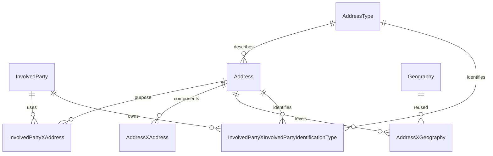

# Structured party addresses

Physical and postal addresses are reconstructed from components. New structured
writes never persist a formatted full address.

An Address is an opaque grouping record with an empty Value. Street name, street
type and postal box kind are reusable Address records linked through AddressXAddress.
Their roles are AddressTypes, never classifications containing street values.
Street number, building name, unit, box number and postal code also have AddressTypes;
their identifying values exist only in protected party-identification rows.
Country, province, district, locality and postal area reference existing geography
records. Building number, building name, unit, box number and delivery/postal code
are protected party identification values scoped by the nullable AddressID FK.
The public geography postal area and the party's delivery code are distinct.

Residential, Postal, Work, Delivery and Billing classify the party-address relationship.
Multiple addresses with the same purpose are supported. Updates retire one
address's links and identifiers using ActiveFlag and effective dates; reference
address components, address types and geography records remain reusable. All writes use the caller's
stateless transaction, enforce party ownership and propagate security failures.
Empty components clear their previous relationships. An end operation retires the
party link and its scoped identification rows. Legacy full values remain readable
for compatibility but must not be copied into a new structured write.

The party-identification AddressID is a real FK; source/provenance columns are not
used as application relationship keys. Apply structured-party-addresses.sql before
starting applications with the updated entity mapping.

The wire keys StreetName and BuildingNumber remain compatible with the profile
contract; their persisted AddressTypes are Street and StreetNumber respectively.
No street text or street number becomes a Classification value.
