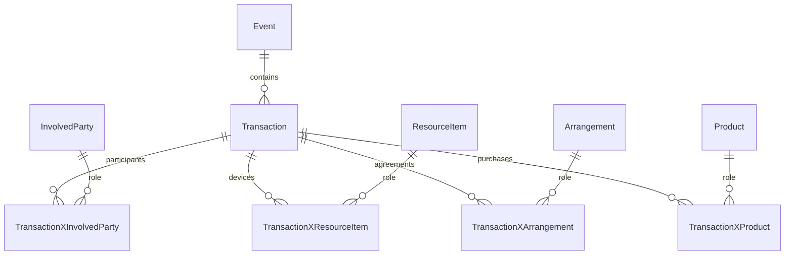

# Transactions in the FSDM model

An Arrangement of type `Wallet` is the account-like business object. Its
`ArrangementXInvolvedParty` relationships record participants and roles. The
same involved party may participate in many wallet arrangements. An Arrangement
of type `Wallet Clearing` represents an authorized external source or sink for
deposits and withdrawals. IDs supplied by a caller never prove access; current
FSDM row security and scope authorization are required.

An existing `Event` is the parent business action. `EventType` identifies a
transaction event; `EventXClassification` may distinguish transfer, deposit,
withdrawal or reversal. `EventXArrangement` links it to every affected
Arrangement. These are existing FSDM entities and relationships.

`transactions.transaction_type` identifies a low-level debit or credit and
fixes its sign. Each transaction carries its Event's idempotency key; there is
no separate posting entity. Each `transactions.entry` references that Event, one
Arrangement and a Transaction Type. Entries have positive decimal amounts and
explicit units. Every unit in an Event balances at commit with at least one
debit and one credit. A transfer debits one wallet Arrangement and credits
another. A deposit credits a wallet and debits a clearing Arrangement; a
withdrawal reverses those signs. Reversals create a new Event and entries.
Posted entries reject update/delete and later additions to a committed Event.

Transactions also have classified, secured relationships to InvolvedParty,
ResourceItem, Arrangement, Event, Product, Address, Geography, Rules, other
Transactions, and Classifications. For example, an involved party can be the
posting actor, payer, payee or cashier; a resource item can be the till/POS
device; an arrangement can be the charged wallet or a purchase agreement.
Relationship classifications describe these roles. The direct Arrangement on
an entry remains its accounting allocation; additional arrangement links do
not count the amount again. The parent Event remains the business action.

The ActivityMaster domain now maps `Transaction` and `TransactionType` as
`WarehouseSCDTable`/EntityAssist entities. `TransactionXTransactionType` is the
explicit typed FSDM relationship. Each has a corresponding Warehouse security
entity (`TransactionSecurityToken`, `TransactionTypeSecurityToken`, and
`TransactionXTransactionTypeSecurityToken`). They are registered in the core
persistence unit; their tables and warehouse columns remain in the managed
`16.transactions.sql` migration. Wallet installation persists its debit/credit
types through the stateless EntityAssist builder and seeds the relationship
classification/data concept.
The core data-concept system provisions `Transaction`, `TransactionType`, and
all transaction relationship concepts before the wallet update runs. Each
relationship has its own warehouse security entity and table. Posting writes
`PostingActor`, `AccountingArrangement` and `ParentEvent` links. Wallet setup
also seeds Payer, Payee, Cashier, PointOfSaleDevice, PurchaseAgreement and
PurchasedProduct roles. Consuming domain flows can persist contextual links
through their EntityAssist builders on the caller's stateless session after
checking current row permissions; those links do not grant access by themselves.

Posted entries are the authoritative movement history.
`TransactionService.balance` sums entries by Arrangement and unit. Wallet
Arrangements cannot post a net debit beyond their balance. Concurrent postings
lock Arrangement rows in stable order before checking funds. Clearing
Arrangements may carry a negative balance. `ArrangementXClassification` may
carry derived balance, available amount or transaction-count metrics, but they
are projections and never spending authority. No summary classification write
is implemented yet; the concepts and refresh policy need a domain decision.

Wallet Master installation seeds the Event action classifications (`WalletTransfer`,
`WalletDeposit`, `WalletWithdrawal`, `WalletReversal`) and Arrangement projection
classifications (`WalletBalance`, `WalletTransactionCount`) under the existing
global data concept. These define vocabulary only; no projection writer exists.
The posting service still requires the `Transaction Event` EventType. Existing Products can be linked using `TransactionXProduct`; wallet setup does
not create catalog products or product types.

## Posting boundary

Use `TransactionService.post(Mutiny.StatelessSession, TransactionService.Call,
...)` inside the caller's `withStatelessTransaction`. The service validates
current plugin and FSDM access on that session, then persists the
transactions, type and participant relationships, and default security rows through EntityAssist
builders. The earlier SQL-pool implementation is retained only as a test fixture
for database rules; production posting has one stateless API.

The caller creates an active Event through the FSDM service, classifies it as
`Transaction Event`, and links affected Arrangements with `EventXArrangement`.
Provision `Wallet` and `Wallet Clearing` types through existing stateless
Arrangement services. The reviewed wallet provider maps to Wallet Master System.
An FSDM installation Event records its exact provider, Realm and owner; separate
FSDM grant Events record each qualified `wallet.post`, `wallet.read` and other
behavior with an involved-party actor link. Their EventTypes and classifications
are qualified by System ID. Installation grants no behavior.

`TransactionService` uses the caller's stateless session. It checks the
current scoped provider grant, then invokes a required host `Authority` on the
same connection to verify current actor and FSDM Event/Arrangement token access.
It checks current Event type, Arrangement type, enterprise, party relationship
and Event-to-Arrangement links. Personal/Social requires each Arrangement to
link to the verified organic party; Work requires the authorized enterprise.
Cross-party transfers need separate explicit authorization and are not accepted
by the personal scope rule. The host authority also checks business policy for
each line. A no-op authority is suitable only for isolated tests.

NE1 resolves the canonical actor after machine/assertion verification, replay
and current account binding. System discovery is not wallet authorization. The
restricted registry discovery pool is not a domain-write pool. Wallet Master supplies REST/GraphQL adapters and a standalone service binder;
NE1 supplies authentication through WalletIdentityProvider. Management UI
remains in the consuming module. See the [wallet API contract](../../wallet/docs/api.md) for host integration.

## Schema and validation

Apply `src/main/resources/db/transactions.sql` through managed migrations after
canonical FSDM. It creates only transaction-specific tables under the new
`transactions` schema. It assumes lowercase canonical identifiers used by NE1.
Focused PostgreSQL tests use minimal canonical FSDM fixtures and cover the
database rules through a SQL test fixture: balanced posting, idempotency,
failed-grant rollback, FSDM relationships, immutable history, insufficient
funds and concurrent event posting. The ActivityMaster test persistence unit
also boots with the new warehouse mappings. Wallet Master's WalletIntegrationTest executes the production stateless EntityAssist
posting path and its REST/GraphQL adapters. Live NE1 authentication and production
migration validation are separate deployment checks.
